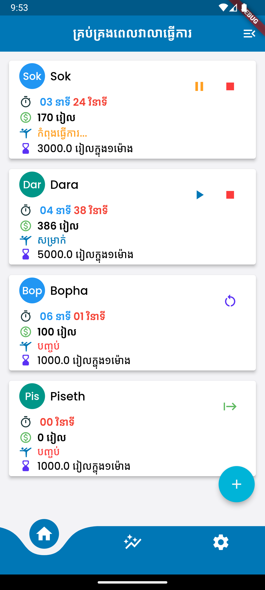
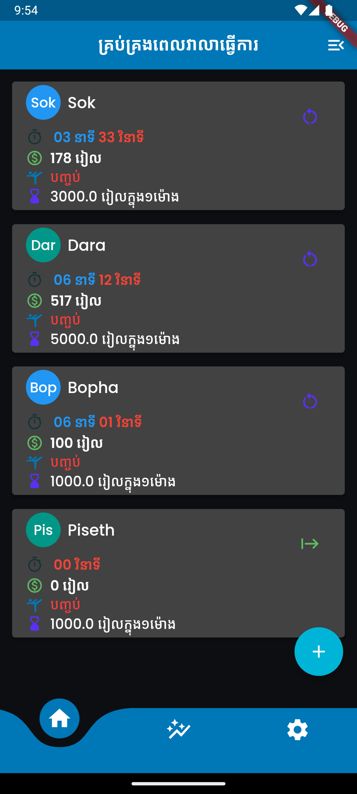
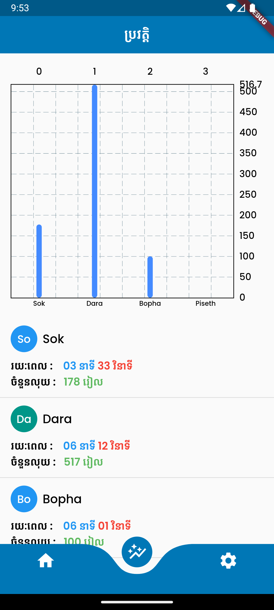
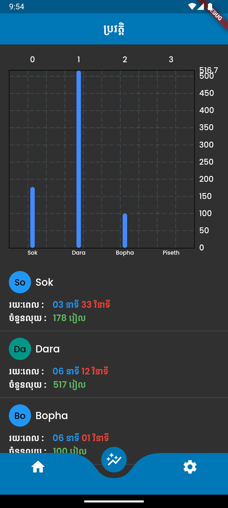
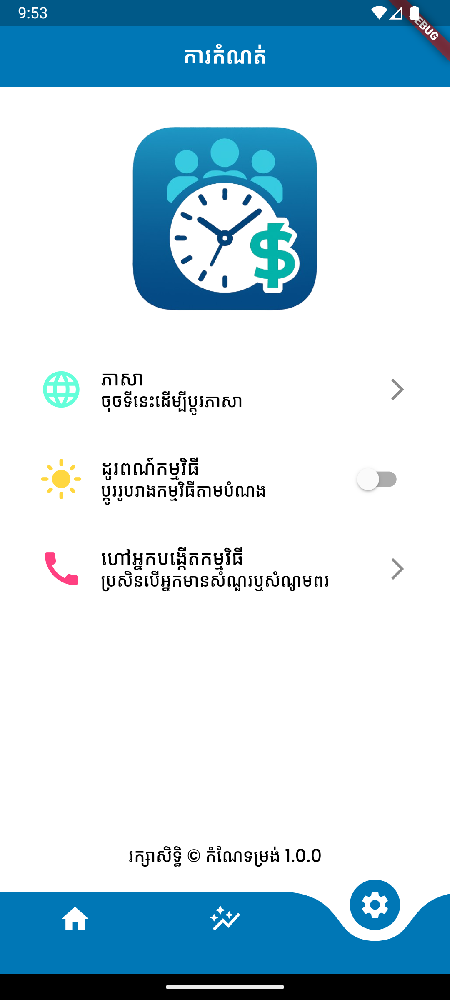
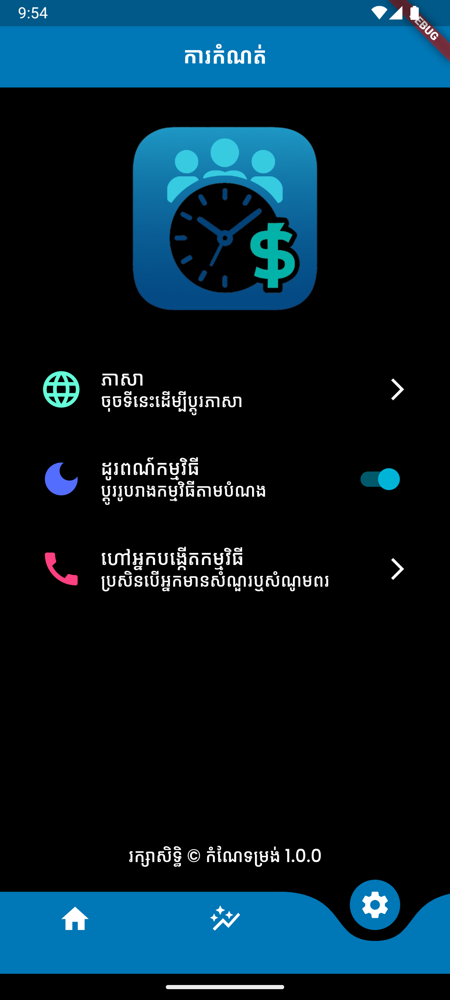

# EMT (Employee Mannagement Time)

A Personal project with a passion of help in the name of the big bro in the family.

## Description

This project is a for **_Family Work_** application. An App help to manage the work of the employees.

## ⏰ Working application

<table>
  <tr>
    <th>Page</th>
    <th>Light Mode</th>
    <th>Dark Mode</th>
  </tr>
  <tr>
    <td><strong>Home Page</strong></td>
    <td></td>
    <td></td>
  </tr>
  <tr>
    <td><strong>History Page</strong></td>
    <td></td>
    <td></td>
  </tr>
  <tr>
    <td><strong>Setting</strong></td>
    <td></td>
    <td></td>
  </tr>
</table>
